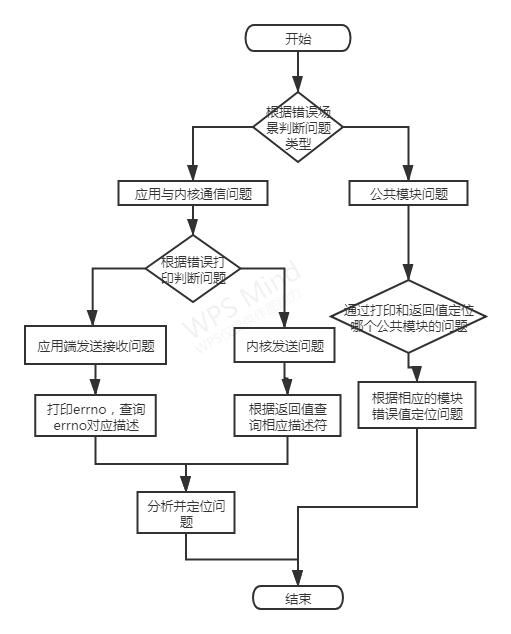

# 前言

## 文档简介
此文档为P166项目开发过程Debug调试文档。
## 目标读者
P166项目开发人员和维护人员。

# 调试工具
## GDB工具
GDB是一个由GNU开源组织发布的、UNIX/LINUX操作系统下的、基于命令行的、功能强大的程序调试工具。对于一名Linux下工作的c++程序员，gdb是必不可少的工具。

### 启动gdb
对C/C++程序的调试，需要在编译前就加上-g选项:

```
$g++ -g hello.cpp -o hello
```

调试可执行文件:

```
$gdb <program>
```

program也就是你的执行文件，一般在当前目录下。  
调试core文件(core是程序非法执行后core dump后产生的文件)。

```
$gdb <program> <core dump file>
$gdb program core.11127
```

调试服务程序。

```
$gdb <program> <PID>
$gdb hello 11127
```

如果你的程序是一个服务程序，那么你可以指定这个服务程序运行时的进程ID。gdb会自动attach上去，并调试他。program应该在PATH环境变量中搜索得到。
## ADB工具
* adb简介  
  adb 全称为 Android Debug Bridge，是 Android SDK 里的一个工具，用于操作管理 Android 模拟器或真实的 Android 设备。其主要功能有：运行设备的 shell（命令行）；管理模拟器或设备的端口映射；在计算机和设备之间上传/下载文件。
* 运行adb
  Windows PC端的adb使用方法和adb应用程序，请自行从网络搜索。
* adb常用命令
  - pc端查看当前连接的设备 

```
adb devices
```

- PC 端进入设备 shell 命令行模式

```
adb shell
```

- 将电脑上的文件上传至设备

```
adb push <local path> <remote path>
```

- 下载设备里的文件到电脑

```
adb pull <remote path> <local path>
```

# 各模块netlink初始化
当netlink初始化失败时，会有失败错误打印，根据打印可定位原因。主要分为两类：netlink套接字创建失败、地址绑定失败。

debug流程如下图：


* 套接字创建失败

```
create socket error!
[errno]93
```

当套接字创建失败时，会返回相应的错误码，根据错误码可定位创建套接字失败的原因。如上所示，可以通过errno值93知道，此错误码的原因为 Protocol not supported，根据原因即可定位问题。
* bind地址绑定失败

```
sh-4.4# ./client_b -f
bind: Address already in use
```

当地址绑定失败时，会返回相应的错误码，根据错误码可定位地址绑定失败的原因。如上所示，根据错误打印可知当前地址已经与一个socket描述符绑定，不可重复绑定。
# 消息通信debug
消息通信出问题时，首先需要根据问题场景定位问题所在环节。一般可分为：公共模块问题和客户端与内核模块通信问题。一般debug流程如下图。  



* 公共模块问题
公共模块的问题可通过将每一次调用公共模块时的结果和返回值打印出来判断调用情况定位问题。
+ 编码和解码功能  
编解码失败时，可以根据编解码函数的返回负值定位失败原因。  
+ 数据封装与解封  
编解码失败时，可以根据编解码函数的返回负值定位失败原因。  
+ hash计算  
hash计算错误时，可根据hash计算函数的返回负值定位失败原因。
+ 应用层与内核模块通信问题
应用层与内核模块的通信问题主要包括3种情况：应用层发送失败、应用层接收失败、内核模块发送失败。根据出错时的打印可判断是内核发送问题还是应用层发送和接收的问题。
+ 应用层发送失败
应用层发送失败之后，可打印errno，可根据错误码描述快速定位问题。

+ 应用层接收失败
应用层接收失败之后，可打印errno，可根据错误码描述快速定位问题。如下所示，当接收消息失败时，打印对应的errno，查询得知对应的errno描述为Bad file descriptor，查询资料可定位问题原因socet描述符是无效的，根据问题定位可解决问题。

```
[recvmsg error!]
[errno]9
```

+ 内核发送失败
内核的netlink发送函数会直接返回错误码的值，可根据错误码负值，查询源码中对应的原因定位问题。常见的发送失败错误码和原因如下：  
errno -11 内核发送socket队列已满，前面的消息应用层还未来得及接收，出现-11的错误码就是内核发送的太快，应用端接收的太慢，想办法加快接收速度或者减慢发送速度即可解决。  
errno -111 #define  ECONNREFUSED  111  /* Connection refused */  
errno -512 ERESTARTSYS
一般是内核发送函数为阻塞式的，当队列满了之后，接收端接收停止，内核模块会一直阻塞在发送消息的命令处，直至应用端被结束，此时就会出现-111 和-512 的错误。解决办法可以给发送消息进行超时处理。
