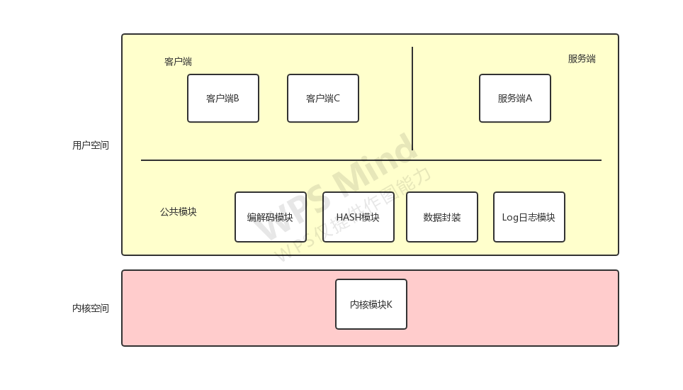
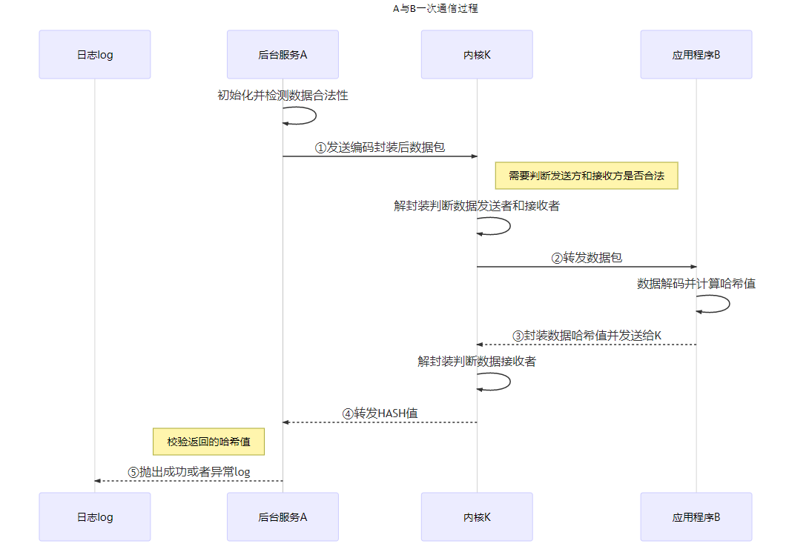
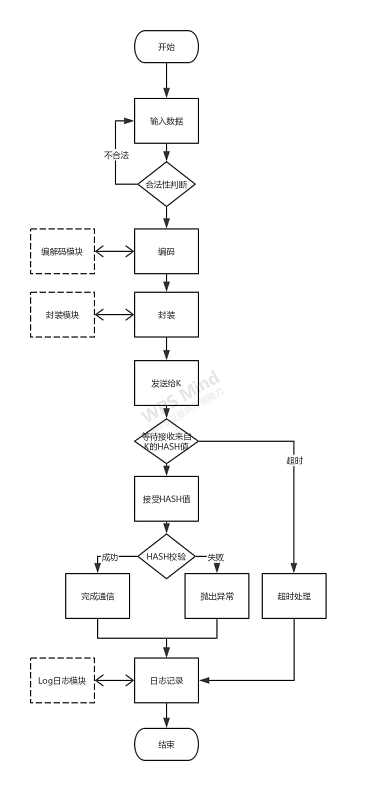
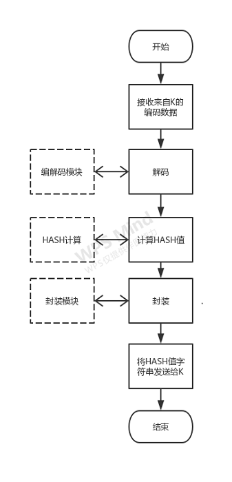
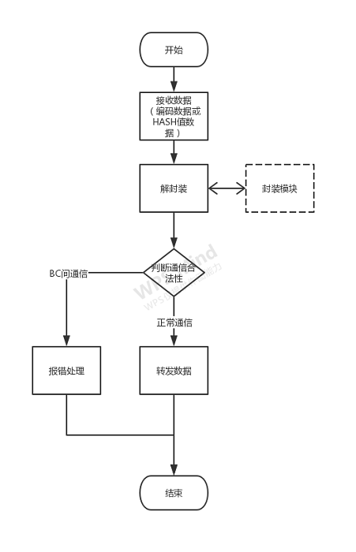
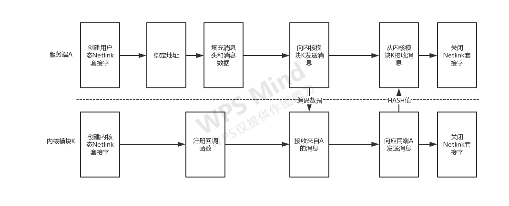

# 概述
##  编写目的
此文档的编写目的是为了更加高效、快速并高质量的完成虚拟项目的开发任务，介绍A100平台上的Demo软件项目概要设计。
## 适用范围
适用范围为全志A100平台。
## 相关人员
全志P616项目Demo软件项目的设计者和开发者。
# 项目介绍
## 项目背景
M 公司是一家采用全志 SOC 集成方案的品牌大客户，7 月份跟全志合作立项, 远程联合开发一个代号 P166 的重要项目，该项目基于全志 A100 平台，为了加快 项目并行进度，P166 项目客户端项目经理 L，向全志 Aserver 平台提交了一 项软件开发需求，要求全志方提供一套易用、稳定、可复用的软件 Demo， 降低客户端前期开发工作量，加快二次开发整体进度。
- 项目负责人：苏佳佳 
- 参与人员：汤健雄、FAE主管、项目经理
## 项目功能介绍
软件Demo包含后台服务应用A、客户端应用 B、客户端应用C和内核模块K四个独立组件。K作为A和B、A和C之间的通信中转站，B和C之间不能通信。软件Demo主要有以下功能。  
Demo功能1：A和B发生一次通信，A将数据包编码后发送给K，K受到数据包转发给B，B对数据包完成逆向解码还原，并将原始数据的HASH值字符串通过K返还给A。A受到HASH值字符串进行正确性校验，校验成功完成通信，校验失败后Log日志抛出异常码ERN110。  
Demo功能2：同理A和C发生通信过程如上，校验失败后Log日志抛出异常码ERN120。  
## 限制条件
- 规格 
  软件开发：保证解耦设计，可被二次定制，具有一定的鲁棒性   
  代码规范：代码风格符合SWC和SW4的代码规范要求，使用git进行统一的管理  
  测试：各个模块支持多种方便、单独的调试手段，支持临时数据的调试，支持命令调试  
  文档：符合软件设计文档规范，并需在内部评审通过  
- 交付说明 
  代码：提交至git仓库——SWC-Bootcamp  
  文档：上传至edoc，具体文档包括：虚拟项目任务计划书，软件概要设计文档，各个组件 的测试列表、测试报告，各个模块代码的静态代码检查报告，组件之间的联调报告，代码的 ROM/RAM分析报告，开发、调试过程的记录文档，总结文档。  
#　软件总体结构设计
##  整体目录结构  

```
├── sprit                         脚本文件
├── docs                          文档目录
├── out                           编译好的各模块文件
├── package                       外部依赖项
├── hdr							  头文件目录，便于各模块调用
| ├──codec.h					  编解码模块头文件
| ├──hash.h						  hash模块头文件
| ├──encapsulation.h			  数据封装头文件
| ├──log.h			  			  日志记录头文件
├── src                           源码文件目录
| ├──kernel						  内核空间目录
| | ├── kernel_k.c				  内核模块K
| | ├── Makefile
| ├── user					      用户空间目录
| | ├── server_a.c                 后台服务A模块，与B、C通信
| | ├── client_b.c                 客户端应用B模块，主要向内核发送、接收信息
| | ├── client_c.c                 客户端应用C模块，主要向内核发送、接收信息
| | ├── codec.c                   编解码模块函数实现
| | ├── hash.c                    哈希算法模块函数实现
| | ├── encapsulation.c			  数据封装函数实现
| | ├── log.c				      log日志实现
├── test                          测试目录                    
├── README.md                     介绍代码的用途、支持的软硬件平台，使用说明
├── tools						  编译工具
└── build.sh                      
```

##  整体结构框图
Demo通信软件主要由四个子模块组成，分别是后台服务应用A、客户端应用B、客户端应用C和内核模块K。除了四个子模块之外有四个公共模块：编解码模块、HASH计算模块、封装模块和日志模块。  
整体的结构框图如下所示  


## 解耦设计
为了提高客户二次开发的效率，我们的demo软件包充分考虑了解耦设计，各个模块只需要调用公共模块的接口即可，若需要二次定制，只需修改公共接口的实现方式。
### 后台服务应用A
后台服务应用A，包括三个子功能，分别是发送数据、接收数据、HASH校验模块。  
**发送数据**：   
对原始数据封装加密之后发送给K，这一过程需要调用数据封装模块和编解码模块。   
将原始数据的HASH值返还给K，这一过程需要调用HASH计算模块和封装模块。  
**接收数据**：   
接收来自K的编码数据，解码还原 。  
-接收来自K的HASH值 。  
**HASH校验**：根据HASH值完成HASH校验，如果成功则完成通信，失败则抛出异常码 ERN120或ERN110。此时需要调用Log日志模块完成记录。  
###  客户端B 
后台服务应用B，包括三个子功能，分别是发送数据、接收数据、HASH校验模块。  
**发送数据**：  
对原始数据封装加密之后发送给K，这一过程需要调用数据封装模块和编解码模块。  
将原始数据的HASH值返还给K，这一过程需要调用HASH计算模块和封装模块。  
**接收数据**：  
接收来自K的编码数据，解码还原。  
接收来自K的HASH值。  
**HASH校验**：根据HASH值完成HASH校验，如果成功则完成通信，失败则抛出异常码ERN110。此时需要调用Log日志模块完成记录。  
### 客户端C
后台服务应用C，包括三个子功能，分别是发送数据、接收数据、HASH校验模块。  
**发送数据**：  
对原始数据加密封装之后发送给K，这一过程需要调用数据封装模块和编解码模块。  
将原始数据的HASH值封装后返还给K，这一过程需要调用HASH计算模块和封装模块。  
**接收数据**：  
接收来自K的编码数据，解码还原。  
接收来自K的HASH值。  
**HASH校验**：根据HASH值完成HASH校验，如果成功则完成通信，失败则抛出异常码ERN120。此时需要调用Log日志模块完成记录。  
### 内核模块K
内核模块K，包括三个子模块分别是接收数据，转发数据和调试端口。  
**接收数据**：接收来自A（B或C）的数据，通过封装字段识别出数据的来源和去向，若是BC之间的通信，则停止转发并报错记录。这一过程需要调用Log日志模块。  
**转发数据**：将受到的数据转发给A（B或C）。  
### 编解码模块
编解码模块需要具备编码功能和解码功能，能被ABC三个模块调用。
### HASH模块
HASH模块需要具备计算HASH值的功能，能被ABC三个模块调用。
### 数据封装模块
对数据进行封装，添加发送者和接收者的信息，方便转发。
对数据进行解封装，识别出发送和接收者的信息，还原原始数据。
### Log日志模块
记录ABC之间的通信信息。
# 模块流程设计
本项目的主要功能就是AB和AC之间的通信，本模块首先从宏观的角度出发，设计A与B发生通信过程时A、B、C、K各个模块的大致流程，然后从细节上设计整个通信过程中，各个子流程的流程图和各个模块的数据调用过程。
## A与B通信过程

完成一次A与B通信的具体步骤如下：

- 后台服务端A、内核模块K、客户端B完成初始化，准备通信
- 后台服务端将合法数据编码封装后转发给K，这一过程需要调用编解码模块和封装模块
- 内核模块K接受数据，解封装并判断发送者和接受者的合法性，这一过程需要调用封装模块
- 内核模块K转发数据包给B
- 客户端B接收数据并进行解码还原，这一过程需要调用编解码模块
- 客户端B计算原始数据的HASH值字符串封装发送给K，这一 过程需要调用封装模块
- 内核模块K接受数据，解封装并判断发送者和接受者的合法性，这一过程需要调用封装模块
- 内核模块K转发HASH值字符串给A
- A接收HASH字符串并进行校验
- 完成通信或者抛出异常


## A完成一次发送数据（向B或C）的过程


## A完成一次接收数据（来自B或C）的过程


## K完成一次转发数据的过程


## A（B或C）与K具体通信过程（netlink方式）
内核模块K和服务应用A通信的过程如下：


后台服务A首先在用户态使用socket()函数创建套接字，然后通过bind函数绑定地址，然后按照相关的规则封装消息，然后通过sendmsg()将封装好的编码信息发送给内核模块K，使用recvmsg接收来自内核模块K的HASH值消息，结束通信后通过close函数关闭套接字，释放资源。  
内核模块K在加载时创建一个内核态的Netlink套接字，指明接收数据的处理函数input()。当收到后台服务应用A的消息时，内核模块K调用input函数进行处理，需要发送消息时，调用netlink_unicast()函数进行单播或netlink_broadcast()函数进行组播，向用户进程发送信息。  

# 接口设计
## 编解码模块接口
### Encode
* 函数原型：
```
int Encode(unsigned char *original_data_str,
          int len, 
          unsigned char *encode_data_str);
```
* 作用：对原始数据进行编码加密
* 参数：
	- 参数1：原始数据
	- 参数2：原始数据长度
	- 编码后数据
* 返回：
	- 1：编码成功
	- -1：编码失败，原始数据类型不合法
	- -2：编码失败，原始数据长度不合法

### Decode
* 函数原型：

```
int Decode(unsigned char *encode_data_str,
            int len, 
            unsigned char *decode_data_str);
```
* 作用：检索指定属性的值
* 参数：
	- 参数1：编码数据
	- 参数2：编码数据长度
	- 参数3：解码后数据	
* 返回：
	- 1：编码成功
	- -1：编码失败，原始数据类型不合法
	- -2：编码失败，原始数据长度不合法
## 封装模块接口
### Encapsulate
* 函数原型：

```
int Encapsulate(unsigned char *original_data_str,
              int len,
              unsigned char *encapsulate_data_str);
```

* 作用：对数据进行打包，加入发送者和接收者的信息
* 参数：
	- 参数1：待打包数据
	- 参数2：带打包数据长度
	- 参数3：接收打包完成数据	
* 返回：
	- 1：封装成功
	- -1：封装失败，数据类型不符
	- -2：封装失败，数据长度不符
### Decapsulate
* 函数原型：

```
int Decapsulate(unsigned char *encapsulate_data_str,
                  int len,
                  unsigned char *original_data_str,
                  int sender,
                  int receiver);
```
* 作用：检索指定属性的值
* 参数：
	- 参数1：封装数据
	- 参数2：封装数据长度
	- 参数3：原始数据
	- 参数4：发送者id
	- 参数5：接收者id
* 返回：
	- 1：解封成功
	- -1：封装失败，数据类型不符
	- -2：封装失败，数据长度不符
	- -3：封装失败，其他
## HASH计算模块接口
### GetHash
* 函数原型：

```
int GetHash(unsigned char *original_data_str,
              int len,
              unsigned char *hash_str)
```
* 作用：计算原始字符串的HASH值
* 参数：
	- 参数1：原始数据
	- 参数2：原始数据长度
	- 参数3：原始数据HASH值字符串
* 返回：
	- 1：计算成功
	- -1：计算失败，数据类型不符
	- -2：计算失败，数据长度不符
	- -3：计算失败，其他
# DEBUG流程
## 函数测试
完成函数测试有如下方法：

- 关键位置打印
- 函数返回值错误码测试
- 不同函数之间互相测试

## 模块测试

内核模块测试  
  - 设备节点创建正常
  - 调试节点创建正常
服务端Ａ测试  
  - 数据发送正常
  - 数据接收正常
  - HASH值校验正常
客户端Ｂ和Ｃ测试  
  - 数据发送正常
  - 数据接收正常
  - HASH值校验正常
公共模块  
  - 编解码模块编码功能正常
  - 编解码模块解码功能正常
  - 数据封装模块数据打包拆包正常
  - HASH计算模块计算功能正常
  - log日志模块添加日志功能正常
不同模块之间的互相交叉测试  

# 出错处理

## 函数返回值

对每个带返回值的函数进行函数返回值的有效性校验，确保代码有效运行。

## 数据有效性

每个模块接受的数据都需要进行有效性检验，如不符合标准则会将其丢弃。

# 总结

这篇概要设计旨在完成客户的最基本的软件需求，还有很多深层次的功能需求并未完成，后续有待改进，改进点如下：

- 为了完成基本通信功能，通信方式上采用了主流的Netlink，并未考虑其他种类的方式
- 在数据的传输过程中，本次设计暂时只考虑了单客户端通信过程，并未考虑并发控制
- 数据的HASH计算方法，暂时考虑Linux自带的md5
- 打包方式，自定义最简单的添加表头的方法，后续有待改进