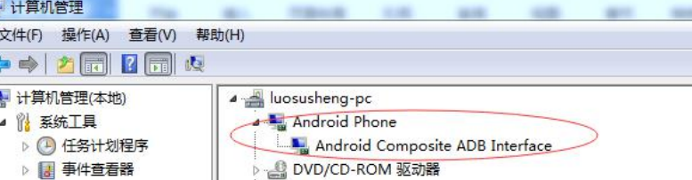
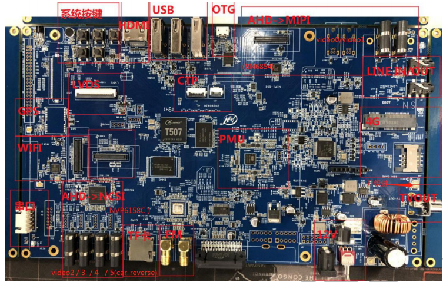
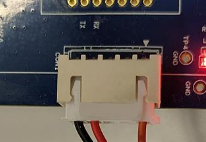
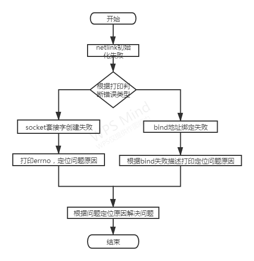
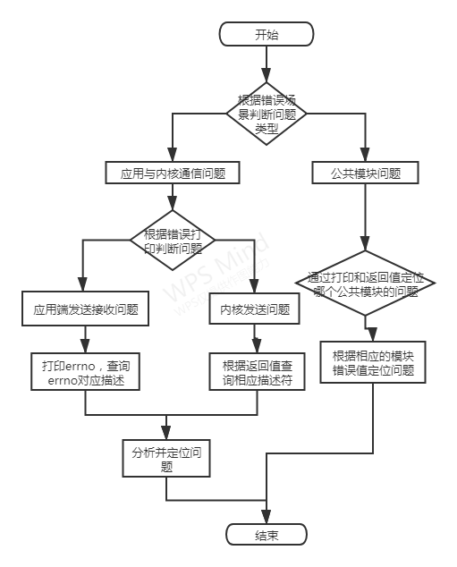

# 前言

## 文档简介
本文档为P166项目Demo软件的用户开发指南。
## 目标读者
在P166项目软件Demo上进行二次开发的开发者和使用者。
## 适用范围
适用范围为全志T507平台。


# 模块介绍
## 模块功能介绍
### 编解码模块
编解码模块的功能包括：数据编码和数据解码。  

* 数据编码  
对发送的字符串编码  

* 数据解码  
对编码字符串进行解码还原  
### hash模块
hash模块的功能包括：字符串hash值计算、文件hash值计算和hash值校验。  

* 字符串hash值计算  
计算字符串的hash值  

* 文件hash值计算  
计算文件的hash值  

* hash值校验  
将原始文件的hash值字符串和收到的hash值字符串进行比较以确认文件的一致性  
### 封装模块
封装模块的功能包括：数据封装和数据解封。  

* 数据封装    
将待发送的数据、发送者、接受者和消息类型等信息一起封装起来。   

* 数据解封    
对封装数据进行解封、获取发送者、接受者、消息类型和数据内容等信息。  

### netlink模块
netlink模块的功能包括：netlink初始化、netlink套接字创建、netlink地址绑定、消息发送和消息接收。

* netlink初始化     
完成客户端和服务端的netlink套接字创建地址初始化与绑定  

* netlink套接字创建  
创建用户态netlink地址套接字  

* netlink地址绑定  
将netlink套接字与相关的地址进行绑定 

* 消息发送  
完成用户态netlink消息发送 

* 消息接收  
完成用户态netlink消息接收  

### 连接控制模块
连接控制模块的功能包括：连接确认和ID获取。

* 连接确认  
根据客户端的连接请求确定是否进行连接  

* ID获取  
获取客户端的prot ID号  

### 服务端模块A
后台服务应用A，包括三个子功能，分别是连接控制、发送数据、接收数据、HASH校验模块和文件传输。

* 连接控制  
服务端根据客户端的连接请求消息控制连接是否建立  

* 发送数据  
服务端可主动向客户端发送消息  

* 接收数据：   
接收来自内核模块K转发的数据   

* HASH校验   
根据HASH值完成HASH校验，如果成功则完成通信，失败则抛出异常码ERN120或ERN110  

* 文件传输  
服务端作为被动的文件中转站，客户端可下载服务端的文件，也可以向服务端上传文件  

### 内核模块K
内核模块K的功能包括：接收数据、数据转发和状态监测  

* 接收数据  
接收来自应用程序的数据，识别出数据的来源和去向  
* 数据转发  
如果通信合法，将收到到的数据转发给接收者   
如果通信非法，将数据丢弃并返回非法信息   

* 状态监测  
定期对应用程序进程的运行状态进行检测，通过dmesg打印出来  

* 调试节点
内核模块创建了debugfs调试节点，可动态观测通信次数

### 客户端模块BC
客户端的功能包括连接请求、发送数据、接收数据、hash校验、文件下载和文件上传  

* 连接请求  
客户端在与服务端通信之前要发送连接请求进行连接，连接成功方可通信     

* 发送数据  
客户端可主动给服务端发送数据  

* 接收数据  
接收来自内核转发的数据  

* hash校验  
对文件或消息的hash值进行校验确保发送接收无误  

* 文件上传  
向服务端上传文件  

* 文件下载  
从服务端目录下载文件  

## 相关术语介绍
### netlink
netlink是用以实现用户进程和内核进程的一种特殊通信机制，也是网络应用程序与内核通信的最常用的接口。    
Netlink 是一种特殊的 socket，它是 Linux 所特有的，类似于 BSD 中的AF_ROUTE 但又远比它的功能强大，目前在Linux中常用在内核空间与用户空间的通信。  
### HASH校验
散列函数（或散列算法，又称哈希函数，英语：Hash Function）是一种从任何一种数据中创建小的数字“指纹”的方法。散列函数把消息或数据压缩成摘要，使得数据量变小，将数据的格式固定下来。该函数将数据打乱混合，重新创建一个叫做散列值（hash values，hash codes，hash sums，或hashes）的指纹。散列值通常用来代表一个短的随机字母和数字组成的字符串。  
hash校验即通过比较两个文件或字符串的散列值去判断两者是否相等。
### 客户端和服务端
客户端一般指应用程序B和应用程序C，服务端一般指服务程序A。
### 内核模块和应用程序
内核模块一般指内核模块k，应用程序指用户态程序A、B和C。


# 模块配置介绍
## 开发环境配置
本章主要介绍了如何在本地搭建编译环境来编译 Longan SDK 源代码。目前本Demo只支持在linux环境下编译 Ubuntu 14.04(64 bit)。一个典嵌入式开发环境通常包括linux服务器、Windows PC 和目标硬件板。linux服务器上建立交叉编译开发环境，为软件开发提供代码更新下载，代码交叉编译服务。


Windows PC和Linux服务器共享程序，Windows PC并安装SecureCRT 或 puTTY，通过网络远程登陆到 Linux 服务器，在 linux 服务器上进行交叉编译和代码的开发调试。 Windows PC通过串口和USB与目标开发板连接，可将编译后的镜像文件烧写到目标开发板，并调试系统或应用程序。

### Linux 服务器环境搭建
* 硬件配置  
  推荐64 位系统，硬盘空间大于30G。如果您需要进行多个构建，请预留更大的硬盘空间。
* 系统版本  

```
Linux SzExdroid20 3.19.0-80-generic #88~14.04.1-Ubuntu SMP Fri Jan 13 14:54:07 UTC 2017 x86_64 GNU/Linux
```

* 网络环境  
安装nfs、samba、ssh等网络组件，并自行配置网络。

* 软件包  
配置好网络环境之后，则可以通过如下命令安装编译需要的软件包。

```
sudo apt-get install git
sudo apt-get install gcc 
sudo apt-get install wget 
sudo apt-get install bison 
sudo apt-get install ncurse 
sudo apt-get install build-essential 
sudo apt-get install zip
```

### windows PC开发环境搭建
* 开发工具  
代码编辑：SourceInsight、Notepad++等  
串口工具：puTTY、Xshell、mobaxterm等  
* 开发板驱动安装  
一般在 Windows7的环境下，当目标板设备上电并插上 USB 线之后，会自 动安装 USB 设备驱动程序。如果安装成功，则会在 Windows 管理器中出现下图中红色椭圆形标识的设备Android Phone。  
在windows10环境下需要自行安装驱动，驱动目录位于


```
tools/windows 7_10_ _32_64 USB-to-Serial Comm Port/windows 7_ 10
```



:::note
  有些电脑在设备上电并插上 USB 线之后，自动安装 USB 设备驱动程 序会失败。推荐使用驱动人生等软件，自动检索安装驱动程序。
:::

### 开发板介绍
本Demo目前暂时在T5平台上运行测试，AW T5的公版如下



:::note
  本软件demo的开发主要关注DCIN12V(连接 12V 直流电源)，CPU 调试串口，USB-OTG micro端口(用于烧录和ADB 调试)。
:::

* 使用准备  
  请检查串口硬件工具以及串口连接线、12V直流电源、以及miniUSB线等是否就绪。
* 开发板供电  
  请使用 12V 直流电源为开发板供电，供电电流推荐2A左右。
* 串口连接  
  默认的调试串口用的是 uart0，电压为 3.3v，连接如下图。
  
  

* usb调试连接  
  请使用 USB Micro数据线，连接开发板和windows PC 和 usb 端口。

## kernel menuconfig 配置说明

```
CONFIG_netlink_k=y
```

## 源码结构介绍
```
├── docs                        项目相关文档目录
├── hdr                         头文件目录
│   ├── codec.h                 编解码头文件
│   ├── connect.h               连接控制模块头文件    
│   ├── encapsulation.h         封装模块头文件
│   ├── hash.h                  hash模块头文件
│   ├── netlink.h               netlink模块头文件
│   └── protocol.h              协议相关头文件
├── kernelspace                 内核源码目录
│   ├── kernel_k.c              内核模块k源码
│   ├── Kconfig                 编译相关配置文件
│   └── Makefile                编译相关配置文件
├── lib                         依赖的外部库
│   ├── include
│   └── lib
├── out                         编译产物目录
│   ├── client_b
│   ├── client_c
│   ├── kernel_k.ko
│   └── server_a
├── README.md                   
├── script                      脚本文件目录
│   └── build.sh
├── src                         源文件目录
│   ├── client_b.c              客户端b源码
│   ├── client_c.c              客户端c源码
│   ├── codec.c                 编解码模块源码
│   ├── connect.c               连接控制模块源码
│   ├── encapsulation.c         封装模块源码
│   ├── hash.c                  hash模块源码
│   ├── Makefile                编译Makefile
│   ├── netlink.c               netlink模块源码    
│   └── server_a.c              服务端a源码
├── tools                       相关工具
└── test                        测试文件目录
    ├── codec_test
    ├── file_test
    ├── hash_test
    ├── netlink_file
    ├── pack_test
    └── socket_file
```

## 编译方式
### 整体编译
进入demo顶级目录，配置好编译工具的环境变量，然后执行编译脚本即可。

```
#export PATH=$PATH:tools/gcc-linaro-7.4.1-2019.02-x86_64_aarch64-linux-gnu/bin/
#./script/build.sh
```
编译后的四个产物会出现在out目录下，通过adb工具推到开发板上即可进行运行调试。
### 单独编译应用程序
进入src/目录,执行make命令。
### 单独编译内核模块
进入kernelspace目录，执行make命令。
### openssl交叉编译
本软件demo中调用了openssl中的相关库函数，某些开发板中可能没有相应的环境，需要自行交叉编译配置。

* 设置环境变量

```
#export ARCH=arm64
#export CROSS_COMPILE=aarch64-linux-gnu-
#export PATH=$PATH:tools/gcc-linaro-7.4.1-2019.02-x86_64_aarch64-linux-gnu/bin/
```
* 获取openssl

```
wget https://www.openssl.org/source/openssl-1.1.1g.tar.gz
tar -xvf openssl-1.1.1g.tar.gz
```

::: warning
  新建安装目录 out，不要命名为 install，windows无法访问。
:::

* 配置、编译、安装


```
./Configure linux-aarch64 --prefix=/home/xixinle/bootcamp2020/src/lib/openssl-1.1.1g/out/
make
make install
```

编译完成之后生成的include和lib目录可被用于交叉编译链接，详情参见各目录下Makefile。

# 模块接口说明
## 编解码模块
### [msg_encode]
```
int msg_encode(const unsigned char *in, unsigned int inlen, char *out);
```
* 作用：数据编码
* 参数：
	- 参数1:待编码数据指针
	- 参数2:待编码数据长度
  - 参数3:接收编码后数据的变量
* 返回：
	- 非负整型：编码后数据长度
  - 负数：失败错误码


### [msg_decode]

```
int msg_decode(const unsigned char *in, unsigned int inlen, char *out);
```
* 作用：数据解码
* 参数：
	- 参数1:待解码数据指针
	- 参数2:待解码数据长度
  - 参数3:接收解码后数据的变量
* 返回：
	- 非负整型：解码后数据长度
  - 负数：失败错误码

## 连接控制模块
### [passwd_vertify]
```
int passwd_vertify(char *passwd, char name);
```
* 作用：确认连接口令是否有效
* 参数：
	- 参数1:连接口令
	- 参数2:连接客户端名称
* 返回：
	- 1：连接成功
  - -1：连接失败

## 封装模块
### [pack]

```
int pack(const unsigned char *in, unsigned int inlen, char recv, char send, char msgtype, char *out);
```

* 作用：数据封装，加入消息头
* 参数：
	- 参数1:待封装消息
	- 参数2:待封装消息长度
	- 参数3:接收者名称
	- 参数4:发送者名称
	- 参数5:消息类型
  - 参数6:接收封装后数据的变量
* 返回：
	- 非负整型：封装后数据长度
  - 负数：失败错误码

### [unpack]
```
int unpack(const unsigned char *in, unsigned int inlen, char *send, char *msgtype, char *out);
```
* 作用：数据解封，解析消息字符串、长度、发送者、消息类型
* 参数：
	- 参数1:待解封消息
	- 参数2:待解封消息长度
	- 参数3:接收发送者变量
	- 参数4:接收消息类型变量
  - 参数5:接收解封后数据的变量
* 返回：
	- 非负整型：解封后数据长度
  - 负数：失败错误码
## hash模块
### [hash_str]

```
int hash_str(const char *str, int len, char *output);
```

* 作用：计算字符串的hash值
* 参数：
	- 参数1:待计算的字符串
	- 参数2:字符串长度
	- 参数3:接收计算的hash值

* 返回：
	- 1：计算成功
  - 负数：失败错误码

### [hash_file]
```
int hash_file(const char *str, int len, char *output);
```
* 作用：计算文件的hash值
* 参数：
	- 参数1:待计算文件的文件名
	- 参数2:文件名长度
	- 参数3:接收计算的hash值

* 返回：
	- 1：计算成功
  - 负数：失败错误码
## netlink模块
### [netlink_init]

```
int netlink_init(int id);
```

* 作用：netlink初始化，完成套接字创建和地址绑定
* 参数：
	- 参数1:端口号

* 返回：
	- 正整数：成功，返回socket描述符
  - 负数：失败错误码

### [netlink_send_message]

```
int netlink_send_message(int sock_fd, const unsigned char *message, int len, unsigned int send_pid, unsigned int recv_pid, unsigned int group);
```

* 作用：通过netlink向内核发送消息
* 参数：
	- 参数1:socket描述符
	- 参数2:待发送消息
	- 参数3:消息长度
	- 参数4:发送者端口号
	- 参数5:接收者端口号
  - 参数6:接收者所在组

* 返回：
	- 0：成功
  - 负数：失败错误码

:::note
  参数5和参数6在向内核发送消息的时候一般是0，内核默认的端口号和组id为0。
:::

### [netlink_send_message]

```
int netlink_recv_message(int sock_fd, unsigned char *message, int *len);
```

* 作用：通过netlink接收来自内核的消息
* 参数：
	- 参数1:socket描述符
	- 参数2:接收消息变量
	- 参数3:消息长度

* 返回：
	- 0：成功
  - 负数：失败错误码


# FAQ

本章介绍软件demo在开发运行的过程中调试方法、调试工具和常见问题。

## 调试方法
### 各模块netlink初始化
当netlink初始化失败时，会有失败错误打印，根据打印可定位原因。主要分为两类：netlink套接字创建失败、地址绑定失败。

debug流程如下图：



* 套接字创建失败

```
create socket error!
[errno]93
```

当套接字创建失败时，会返回相应的错误码，根据错误码可定位创建套接字失败的原因。如上所示，可以通过errno值93知道，此错误码的原因为 Protocol not supported，根据原因即可定位问题。
* bind地址绑定失败

```
sh-4.4# ./client_b -f
bind: Address already in use
```

当地址绑定失败时，会返回相应的错误码，根据错误码可定位地址绑定失败的原因。如上所示，根据错误打印可知当前地址已经与一个socket描述符绑定，不可重复绑定。
### 消息通信debug
消息通信出问题时，首先需要根据问题场景定位问题所在环节。一般可分为：公共模块问题和客户端与内核模块通信问题。一般debug流程如下图。  



* 公共模块问题
公共模块的问题可通过将每一次调用公共模块时的结果和返回值打印出来判断调用情况定位问题。
+ 编码和解码功能  
编解码失败时，可以根据编解码函数的返回负值定位失败原因。  
+ 数据封装与解封  
编解码失败时，可以根据编解码函数的返回负值定位失败原因。  
+ hash计算  
hash计算错误时，可根据hash计算函数的返回负值定位失败原因。
+ 应用层与内核模块通信问题
应用层与内核模块的通信问题主要包括3种情况：应用层发送失败、应用层接收失败、内核模块发送失败。根据出错时的打印可判断是内核发送问题还是应用层发送和接收的问题。
+ 应用层发送失败
应用层发送失败之后，可打印errno，可根据错误码描述快速定位问题。

+ 应用层接收失败
应用层接收失败之后，可打印errno，可根据错误码描述快速定位问题。如下所示，当接收消息失败时，打印对应的errno，查询得知对应的errno描述为Bad file descriptor，查询资料可定位问题原因socet描述符是无效的，根据问题定位可解决问题。

```
[recvmsg error!]
[errno]9
```

+ 内核发送失败
内核的netlink发送函数会直接返回错误码的值，可根据错误码负值，查询源码中对应的原因定位问题。常见的发送失败错误码和原因如下：  
errno -11 内核发送socket队列已满，前面的消息应用层还未来得及接收，出现-11的错误码就是内核发送的太快，应用端接收的太慢，想办法加快接收速度或者减慢发送速度即可解决。  
errno -111 #define  ECONNREFUSED  111  /* Connection refused */  
errno -512 ERESTARTSYS
一般是内核发送函数为阻塞式的，当队列满了之后，接收端接收停止，内核模块会一直阻塞在发送消息的命令处，直至应用端被结束，此时就会出现-111 和-512 的错误。解决办法可以给发送消息进行超时处理。

## 调试工具
### adb调试
* adb简介  
  adb 全称为 Android Debug Bridge，是 Android SDK 里的一个工具，用于操作管理 Android 模拟器或真实的 Android 设备。其主要功能有：运行设备的 shell（命令行）；管理模拟器或设备的端口映射；在计算机和设备之间上传/下载文件。
* 运行adb
  Windows PC端的adb使用方法和adb应用程序，请自行从网络搜索。
* adb常用命令
  - pc端查看当前连接的设备 

```
adb devices
```

  - PC 端进入设备 shell 命令行模式

```
adb shell
```

  - 将电脑上的文件上传至设备

```
adb push <local path> <remote path>
```

  - 下载设备里的文件到电脑

```
adb pull <remote path> <local path>
```

### GDB调试工具
开发板中有标准gdb工具可以在开发板上进行本地调试。在终端可以直接运行gdb来调试程序
```
root@kunos:/# gdb
GNU gdb (GDB) 8.1.1
Copyright (C) 2018 Free Software Foundation, Inc.
License GPLv3+: GNU GPL version 3 or later <http://gnu.org/licenses/gpl.html>
This is free software: you are free to change and redistribute it.
There is NO WARRANTY, to the extent permitted by law.  Type "show copying"
and "show warranty" for details.
This GDB was configured as "aarch64-buildroot-linux-gnu".
Type "show configuration" for configuration details.
For bug reporting instructions, please see:
<http://www.gnu.org/software/gdb/bugs/>.
Find the GDB manual and other documentation resources online at:
<http://www.gnu.org/software/gdb/documentation/>.
For help, type "help".
Type "apropos word" to search for commands related to "word".
(gdb)
(gdb)
```

## 调试节点
本demo的内核模块创建了debugfs调试节点，可通过调试节点查看通信次数、应用运行状态等等信息。挂载debugfs，进入创建的节点即可进行调试。

```
root@kunos:/root# mkdir debugfs
root@kunos:/root# mount -t debugfs none ./debugfs
root@kunos:/root# cd debugfs/communiation_debugfs/
```

## 常见问题

