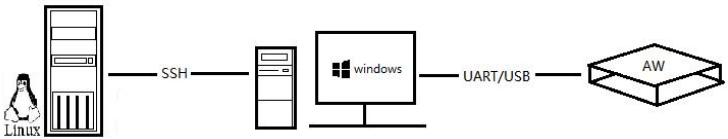

# 前言

## 文档简介
此文档为P166项目软件demo的测试报告。
## 目标读者
P166项目开发者和验收人员。

## 项目背景
M 公司是一家采用全志SOC集成方案的品牌大客户,7月份跟全志合作立项, 远程联合开发一个代号 P166的重要项目,该项目基于全志A100平台,为了加快项目并行进度,P166项目客户端项目经理 L,向全志Aserver平台提交了一项软件开发需求,要求全志方提供一套易用、稳定、可复用的软件 Demo,降低客户端前期开发工作量,加快二次开发整体进度。

- 项目负责人：苏佳佳 
- 参与人员：汤健雄、FAE主管、项目经理
### 功能需求
软件Demo包含后台服务应用 A、客户端应用 B、客户端应用 C和内核模块 K四个独立组件。K作为A和B、A和C之间的通信中转站,B和C之间不能通信。 

Demo功能1：A和B发生一次通信,A将数据包编码后发送给K,K受到数据包转发给B,B对数据包完成逆向解码还原,并将原始数据的HASH值字符串通过K返还给A。A受到HASH值字符串进行正确性校验,校验成功完成通信,校验失败后Log日志抛出异常码ERN110。  

Demo功能2：同理A和C发生通信过程如上,校验失败后Log日志抛出异常码ERN120。  
## 限制条件

- 规格 
  软件开发：保证解耦设计,可被二次定制,具有一定的鲁棒性   
  代码规范：代码风格符合SWC和SW4的代码规范要求,使用git进行统一的管理  
  测试：各个模块支持多种方便、单独的调试手段,支持临时数据的调试,支持命令调试  
  文档：符合软件设计文档规范,并需在内部评审通过

- 交付说明 
  代码：提交至git仓库——SWC-Bootcamp

  文档：上传至edoc,具体文档包括：虚拟项目任务计划书,软件概要设计文档,各个组件 的测试列表、测试报告,各个模块代码的静态代码检查报告,组件之间的联调报告,代码的 ROM/RAM分析报告,开发、调试过程的记录文档,总结文档。
## 测试目标
本次测试是针对P166项目进行的验收测试,目的为了判定改系统是否满足交付要求中规定的功能与性能指标。
## 测试范围及方法

| 序号 | 测试项目     | 测试方法  | 测试工具  |
|------|--------------|-----------|-----------|
| 1    | 安装部署测试 | 黑盒/手工 | 无        |
| 2    | 模块功能测试 | 黑盒/手工 | shell脚本 |
| 3    | 系统功能测试 | 黑盒/手工 | shell脚本 |
| 4    | 联调测试     | 黑盒/手工 | shell脚本 |
| 5    | 性能测试     | 黑盒/手工 | 无        |
| 6    | 安全性       | 黑盒/手工 | 无        |
Table: 测试范围及方法

## 测试环境
本软件demo的测试运行环境主要分为三个部分,Windows pc、Linux编译器和目标硬件板。主要过程是代码通过Linux编译器编译成功之后,在Windows pc上通过串口工具和其他调试工具将编译产物推送到目标硬件板上进行测试。

{width=80% height=80% position=center angle=0}

| 测试环境        | 硬件配置              | 系统版本            | 网络环境      | 依赖工具                                                   |
|-----------------|-----------------------|---------------------|---------------|------------------------------------------------------------|
| Linux编译服务器 | 硬盘30G,支持64位系统 | Ubuntu 14.04.5 LTS  |  正常网络环境 | gcc,ncurse,bison,autoconf,  wget,patch,texinfo和zlib等 |
|  Windows PC     | 正常配置              | Windows 7           |  正常网络环境 |  串口工具和adb工具                                         |
| 硬件开发板      | T507开发板            | Linux kunos 4.9.170 |  正常网络环境 | shell脚本、GDB工具                                         |
Table: 总体运行环境

# 安装部署测试
## 编译运行测试
测试源码是否能正常编译部署运行。
### 前置条件
+ Linux编译服务器具备相关的交叉编译工具,且环境变量设置正确
+ Windows PC与开发板连接成功,串口工具与adb工具运行正常
+ 开发板系统运行正常
### 测试方法
+ 下载相关源码,进入顶层目录
+ 直接执行编译脚本：./script/build.sh
+ 采用adb push工具将out目录下的产物推送到开发板环境中
+ 串口或adb环境运行所有的编译产物
### 测试通过条件
+ 编译无警告和错误
+ out目录下生成：client_b,client_c,server_a和kernel_k.ko 四项编译产物
+ 将编译产物推送到开发板环境可正常执行
### 测试结论
编译无警告,产物生成正常,推送到开发板上可正常运行,安装部署测试通过。

# 功能测试
## 编码功能测试
测试编解码模块编码功能
### 前置条件
+ test/encode_test/目录下代码编译成功无告警
### 测试用例

| 测试用例      | 内容描述        | 备注       | 通过条件     | 通过情况 |
|---------------|-----------------|------------|--------------|----------|
| encode_test_1 | NULL空指针      | 异常测试   | 异常返回值-2 | pass     |
| encode_test_2 | 字符串长度1+    | 正常测试   | 编码成功     | pass     |
| encode_test_3 | 字符串长度10+   | 正常测试   | 编码成功     | pass     |
| encode_test_4 | 字符串长度100+  | 正常测试   | 编码成功     | pass     |
| encode_test_5 | 字符串长度200+  | 正常测试   | 编码成功     | pass     |
| encode_test_6 | 字符串长度500+  | 正常测试   | 编码成功     | pass     |
| encode_test_7 | 字符串长度800+  | 正常测试   | 编码成功     | pass     |
| encode_test_8 | 字符串长度1400  | 边界值测试 | 编码成功     | pass     |
| encode_test_9 | 字符串长度1401+ | 异常测试   | 返回异常值-3 | pass     |
Table:编码功能测试用例

### 测试方法
+ 进入test/encode_test/,执行make命令
+ 根据测试用例,运行测试文件,查看测试用例通过情况
### 测试通过条件
+ 通过所有的测试用例
### 测试结论
编码功能测试通过

## 解码功能测试
测试编解码模块的解码功能
### 前置条件
+ test/decode_test/目录下代码编译成功无告警
### 测试用例

| 测试用例 | 内容描述              | 备注                         | 通过条件                 | 通过情况 |
|----------|-----------------------|------------------------------|--------------------------|----------|
| decode_test_1 | NULL空指针               | 异常测试             | 异常返回值-2             | pass     |
| decode_test_2 | 字符串长度1+ | 正常测试       | 解码成功 | pass     |
| decode_test_3 | 字符串长度10+   | 正常测试    | 解码成功 | pass     |
| decode_test_4 | 字符串长度100+ | 正常测试   | 解码成功 | pass     |
| decode_test_5 | 字符串长度200+ | 正常测试   | 解码成功 | pass     |
| decode_test_6 | 字符串长度500+  | 正常测试   | 解码成功 | pass     |
| decode_test_7 | 字符串长度800+ | 正常测试   | 解码成功 | pass     |
| decode_test_8 | 字符串长度1400 | 边界值测试 | 解码成功 | pass     |
| decode_test_9 | 字符串长度1401+ | 异常测试   | 返回异常值-3             | pass     |
Table:解码功能测试用例

### 测试方法
+ 进入test/decode_test/,执行make命令,生成测试文件
+ 根据测试用例,运行测试文件,查看测试用例通过情况
### 测试通过条件
+ 通过所有的测试用例
### 测试结论
解码功能测试通过

## 字符串hash计算测试
测试hash模块的字符串hash值计算功能
### 前置条件
+ test/hash_str_test/目录下代码编译成功无告警
### 测试用例
| 测试用例       | 内容描述        | 备注       | 通过条件       | 通过情况 |
|----------------|-----------------|------------|----------------|----------|
| hashstr_test_1 | NULL空指针      | 异常测试   | 异常返回值-2   | pass     |
| hashstr_test_2 | 字符串长度1+    | 正常测试   | hash值正确计算 | pass     |
| hashstr_test_3 | 字符串长度10+   | 正常测试   | hash值正确计算 | pass     |
| hashstr_test_4 | 字符串长度100+  | 正常测试   | hash值正确计算 | pass     |
| hashstr_test_5 | 字符串长度200+  | 正常测试   | hash值正确计算 | pass     |
| hashstr_test_6 | 字符串长度500+  | 正常测试   | hash值正确计算 | pass     |
| hashstr_test_7 | 字符串长度800+  | 正常测试   | hash值正确计算 | pass     |
| hashstr_test_8 | 字符串长度1400  | 边界值测试 | hash值正确计算 | pass     |
| hashstr_test_9 | 字符串长度1401+ | 异常测试   | 返回异常值-3   | pass     |
Table:字符串hash值计算功能测试用例

### 测试方法
+ 进入test/hash_str_test/,执行make命令
+ 根据测试用例,运行测试文件,查看测试用例通过情况
### 测试通过条件
+ 通过所有的测试用例
### 测试结论
字符串hash值计算功能测试通过

## 文件hash值计算测试
测试hash模块的文件hash值计算功能
### 前置条件
+ test/hash_file_test/目录下代码编译成功无告警
### 测试用例

| 测试用例        | 内容描述    | 备注                 | 通过条件       | 通过情况 |
| --------------- | ----------- | -------------------- | -------------- | -------- |
| hashfile_test_1 | NULL        | 空指针               | 异常返回值-2   | pass     |
| hashfile_test_2 | tysiadasd   | 不存在的相对路径文件 | 异常返回值-1   | pass     |
|                 |             |                      | 打印异常信息   |          |
| hashfile_test_3 | /tysi/adasd | 不存在的绝对路径文件 | hash值正确计算 | pass     |
| hashfile_test_4 | Makefile    | 相对路径文件         | hash值正确计算 | pass     |
| hashfile_test_5 | 1.txt       | 相对路径文本文件     | hash值正确计算 | pass     |
| hashfile_test_6 | 1.jpg       | 相对路径图片文件     | hash值正确计算 | pass     |
| hashfile_test_7 | /1.txt      | 绝对路径文件         | hash值正确计算 | pass     |
Table: 文件hash值计算测试用例

### 测试方法
+ 进入test/hash_file_test/,执行make命令
+ 根据测试用例,运行测试文件,查看测试用例通过情况
### 测试通过条件
+ 通过所有的测试用例
### 测试结论
文件hash值计算功能测试通过

## 封装功能测试
测试封装模块的功能是否正常
### 前置条件
+ test/pack_test/目录下代码编译成功无告警
### 测试用例
| 测试用例    | 内容描述                       | 备注                     | 通过条件                | 通过情况 |
|-------------|--------------------------------|--------------------------|-------------------------|----------|
| pack_test_1 | NULL,a,b,m                  | 空字符指针,  其他内容正常 | 异常返回值-2            | pass     |
| pack_test_2 | 字符串（长度123）,a,b,q       | 未知消息类型             | 异常打印 | pass     |
| pack_test_3 | 字符串（长度200+）,a,b,m  | 正常输入                 | 正确封装    | pass     |
| pack_test_4 | 字符串（长度500+）,a,b,m  | 正常输入                 | 正确封装  | pass     |
| pack_test_5 | 字符串（长度800+）,a,b,m  | 正常输入                 | 正确封装  | pass     |
| pack_test_6 | 字符串（长度1000+）,a,b,m | 正常输入                 | 正确封装  | pass     |
| pack_test_7 | 随机字符串（长度1301+）,a,b,m | 字符串长度  超过最大值     | 返回异常值-3            | pass     |
Table:封装功能测试用例

### 测试方法
+ 进入test/pack_test/,执行make命令
+ 根据测试用例,运行测试文件,查看测试用例通过情况
### 测试通过条件
+ 通过所有的测试用例
### 测试结论
封装功能测试通过

## 解封装功能测试
测试解封装模块的功能是否正常
### 前置条件
+ test/unpack_test/目录下代码编译成功无告警
### 测试用例

| 测试用例      | 内容描述                | 备注                     | 通过条件                       | 通过情况 |
|---------------|-------------------------|--------------------------|--------------------------------|----------|
| unpack_test_1 | NULL                    | 空字符指针,  其他内容正常 | 异常返回值-2                   | pass     |
| unpack_test_2 | 字符串（长度10+）       | 正常输入                 | 输出正确消息 | pass     |
|  |  |  | 发送者和消息类型 |  |
| unpack_test_3 | 封装字符串（长度200+）  | 正常输入                 | 输出正确消息 | pass     |
|  |  |  | 发送者和消息类型 |  |
| unpack_test_4 | 封装字符串（长度500+）  | 正常输入                 | 输出正确消息 | pass     |
|  |  |  | 发送者和消息类型 |  |
| unpack_test_5 | 封装字符串（长度800+）  | 正常输入                 | 输出正确消息 | pass     |
|  |  |  | 发送者和消息类型 |  |
| unpack_test_6 | 封装字符串（长度1000+） | 正常输入                 | 输出正确消息 | pass     |
|  |  |  | 发送者和消息类型 |  |
| unpack_test_7 | 封装字符串（长度1400+） | 字符串长度超过最大值     | 返回异常值-3                   | pass     |
Table:封装功能测试用例

### 测试方法
+ 进入test/unpack_test/,执行make命令
+ 根据测试用例,运行测试文件,查看测试用例通过情况
### 测试通过条件
+ 通过所有的测试用例
### 测试结论
封装功能测试通过

## netlink初始化测试
测试netlink模块的netlink初始化功能是否正常,主要包括用户态netlink socket创建、地址初始化和bind地址绑定等功能是否成功。
### 前置条件
+ 进入test/netlink_test/测试用例编译无告警
+ 生成产物可在目标开发板上正常运行，kernel_test.ko模块成功运行
### 测试用例

| 测试用例       | 内容描述                                 | 备注     | 通过条件                             | 通过情况 |
|----------------|------------------------------------------|----------|--------------------------------------|----------|
| netlink_test_1 | 内核模块未加载 | 异常测试 | 打印创建          | pass     |
|  | 直接初始化用户态netlink |  | 套接字失败  [errno]93 |  |
| netlink_test_2 | 加载内核模块 | 异常测试 | 打印bind失败           | pass     |
|  | 使用同一个端口号初始化两次 |  | ，地址已被使用 |  |
| netlink_test_3 | 加载内核模块    | 正常测试 | 打印初始化成功 | pass     |
|  | 执行netlink初始化          |  | ，返回正确socket描述符 |  |
Table:netlink初始化测试用例

### 测试方法
+ 进入test/netlink_test/，执行./build.sh编译测试用例
+ 将生成的out/目录下的产物推送到目标开发板上，增加执行权限
+ 按照测试用例的描述进行测试，观测相应的结果
### 测试通过条件
通过所有的测试用例，除了能够支持正常的用户态初始化功能之外，还需要对一些异常情况作出相应的反馈。
### 测试结论
netlink初始化功能正常，且能够对一些异常情况作出相应的处理。

## netlink模块消息功能测试
测试netlink模块的消息发送与接收功能是否正常，主要体现在能够调用相关接口函数与内核模块进行正常通信。
### 前置条件
+ 进入test/netlink_test/测试用例编译无告警
+ 生成产物可在目标开发板上正常运行，kernel_test.ko模块成功运行
### 测试用例
| 测试用例                | 内容描述                           | 备注       | 通过条件                                     | 通过情况 |
|-------------------------|------------------------------------|------------|----------------------------------------------|----------|
| netlink_sendrecv_test_1 | 发送长度为1400 | 正常测试   | 内核收到字符串并转发， | pass     |
|  | 以内的随机字符串 |  | 用户态成功接收 |  |
| netlink_sendrecv_test_2 | 快速循环发送长度 | 高频次测试 | 每次发送和                   | pass     |
|  | 为1400的随机字符串 |  | 接收都正常 |  |
| netlink_sendrecv_test_3 | 当消息发送时   | 异常测试   | 发送失败，                   | pass     |
|  | 移除内核模块 |  | 打印异常码 |  |
Table: netlink消息发送接收测试用例
### 测试方法
+ 进入test/netlink_test/，执行./build.sh编译测试用例
+ 将生成的out/目录下的产物推送到目标开发板上，增加执行权限
+ 按照测试用例的描述进行测试，观测相应的结果
### 测试通过条件
通过所有的测试用例，除了能够支持正常的用户态内核态通信之外，还需要完成大量快速的通信的收发和一些异常情况的处理。
### 测试结论
netlink消息功能正常，可与内核之间完成大量数据的快速收发，也可以对一些异常情况作出处理。

## 系统消息通信功能测试
验证系统的消息通信功能是否正常，首先保证Demo功能正常，即AB通信、AC通信正常。然后保证多次通信数据传输过程的每个环节都正常工作。最后，对可能出现的一些异常情况进行测试。
### 前置条件
+ 源码编译无告警，能正常生成产物，能在目标板上正常运行
+ 各模块netlink初始化功能正常
+ 各公共模块功能正常
### 测试用例
| 测试用例            | 内容描述                               | 备注     | 通过条件                             | 通过情况 |
|---------------------|----------------------------------------|----------|--------------------------------------|----------|
| netlink_msg_test_1  | b向a发送长度为1400以内 | 正常测试 | 各环节工作正常                       | pass     |
|  | 的随机字符串           |  |  |  |
| netlink_msg_test_2  | a向b发送长度为1400以内 | 正常测试 | 各环节工作正常                       | pass     |
|  | 的随机字符串 |  |  |  |
| netlink_msg_test_3  | a向c发送长度为1400以内 | 正常测试 | 各环节工作正常                       | pass     |
|  | 的随机字符串 |  |  |  |
| netlink_msg_test_4  | c向a发送长度为1400以内 | 正常测试 | 各环节工作正常                       | pass     |
|  | 的随机字符串 |  |  |  |
| netlink_msg_test_5  | ab高频次互发长度为1400 | 正常测试 | 各环节工作正常                       | pass     |
|  | 以内的随机字符串 |  |  |  |
| netlink_msg_test_6  | ac高频次互发长度为1400 | 正常测试 | 各环节工作正常                       | pass     |
|  | 以内的随机字符串 |  |  |  |
| netlink_msg_test_7  | 发送长度为1400+          | 异常测试 | 发送端提示 | pass     |
|  | 的字符串               |  | 长度超过最大长度无法发送 |  |
| netlink_msg_test_8  | bc之间发送消息                         | 异常测试 | 内核丢弃消息 | pass     |
|  |  |  | 并向发送方反馈非法通信 |  |
| netlink_msg_test_9  | 通信过程中     | 异常测试 | 内核向反馈消     | pass     |
|  | 接收端进程被中止 |  | 息接收端未运行 |  |
| netlink_msg_test_10 | b、c同时向a    | 并发测试 | 各环节工作正常                       | pass     |
|  | 发送长度不定的消息 |  |  |  |
Table: 系统通信功能测试

### 测试方法
+ 进入顶层目录，执行./script/build.sh进行系统编译，生成的产物在out目录下
+ 将生成的out/目录下的产物推送到目标开发板上，增加执行权限
+ 按照测试用例的内容描述进行测试

### 测试通过条件
+ 通过基本的Demo功能需求测试，即实现AB、AC间的通信流程，且BC间无法通信
+ 通过大规模并发通信场景测试
+ 对出现的的一些异常情况有相应的处理机制

### 测试结论
系统消息通信功能基本正常，且满足大规模并发通信，对部分的异常情况有相应应对措施。

## 系统文件上传功能测试
验证BC客户端向服务端上传文件功能是否正常
### 前置条件
+ 源码编译无告警，能正常生成产物，能在目标板上正常运行
+ 各模块netlink初始化功能正常
+ 各公共模块功能正常
### 测试用例
| 测试用例           | 内容描述         | 备注     | 通过条件         | 通过情况 |
| ------------------ | ---------------- | -------- | ---------------- | -------- |
| file_upload_test_1 | 输入客户端目录   | 异常测试 | 打印文件不存在   | pass     |
|                    | 不存在的文件     |          | ，提升重新输入   |          |
| file_upload_test_2 | 传输1k左右文件   | 正常测试 | 文件上传完成     | pass     |
|                    |                  |          | ，hash值校验成功 |          |
| file_upload_test_3 | 传输10k左右文件  | 正常测试 | 文件上传完成     | pass     |
|                    |                  |          | ，hash值校验成功 |          |
| file_upload_test_4 | 传输100k左右文件 | 正常测试 | 文件上传完成     | pass     |
|                    |                  |          | ，hash值校验成功 |          |
| file_upload_test_5 | 传输1M左右文件   | 正常测试 | 文件上传完成     | pass     |
|                    |                  |          | ，hash值校验成功 |          |
| file_upload_test_6 | 传输10M左右文件  | 正常测试 | 文件上传完成     | pass     |
|                    |                  |          | ，hash值校验成功 |          |
| file_upload_test_7 | 传输100M左右文件 | 正常测试 | 文件上传完成     | pass     |
|                    |                  |          | ，hash值校验成功 |          |
| file_upload_test_8 | BC同时传输       | 并发测试 | 文件上传完成     | pass     |
|                    | 100M左右文件     |          | ，hash值校验成功 |          |
Table：文件上传测试用例

### 测试方法
+ 进入顶层目录，执行./script/build.sh进行系统编译，生成的产物在out目录下
+ 将生成的out/目录下的产物推送到目标开发板上，增加执行权限
+ 加载内核模块，将服务端A与客户端BC分别放入 out/server out/clientb out/clientc目录运行
+ 将相关测试传输文件放入相应的目录
### 测试通过条件
+ 通过不同大小文件的上传功能测试
+ 通过并发的文件上传测试
### 测试结论
系统文件上传功能正常，可支持多个客户端同时上传文件，且对部分异常情况有相应的处理。

## 系统文件下载功能测试
验证BC客户端从服务端下载文件功能是否正常
### 前置条件
+ 源码编译无告警，能正常生成产物，能在目标板上正常运行
+ 各模块netlink初始化功能正常
+ 各公共模块功能正常
### 测试用例

| 测试用例           | 内容描述         | 备注     | 通过条件           | 通过情况 |
| ------------------ | ---------------- | -------- | ------------------ | -------- |
| file_upload_test_1 | 输入服务端目录   | 异常测试 | 服务端反馈异常消息 | fail     |
|                    | 不存在的文件     |          | ，文件不存在       |          |
| file_upload_test_2 | 传输1k左右文件   | 正常测试 | 文件下载完成       | pass     |
|                    |                  |          | ，，hash值校验成功 |          |
| file_upload_test_3 | 传输10k左右文件  | 正常测试 | 文件下载完成       | pass     |
|                    |                  |          | ，hash值校验成功   |          |
| file_upload_test_4 | 传输100k左右文件 | 正常测试 | 文件下载完成       | pass     |
|                    |                  |          | ，hash值校验成功   |          |
| file_upload_test_5 | 传输1M左右文件   | 正常测试 | 文件下载完成       | pass     |
|                    |                  |          | ，hash值校验成功   |          |
| file_upload_test_6 | 传输10M左右文件  | 正常测试 | 文件下载完成       | pass     |
|                    |                  |          | ，hash值校验成功   |          |
| file_upload_test_7 | 传输100M左右文件 | 正常测试 | 文件下载完成       | pass     |
|                    |                  |          | ，hash值校验成功   |          |
| file_upload_test_8 | BC同时传输       | 并发测试 | 文件下载完成       | pass     |
|                    | 100M左右文件     |          | ，hash值校验成功   |          |
Table：文件下载测试用例
### 测试方法
+ 进入顶层目录，执行./script/build.sh进行系统编译，生成的产物在out目录下
+ 将生成的out/目录下的产物推送到目标开发板上，增加执行权限
+ 加载内核模块，将服务端A与客户端BC分别放入 out/server out/clientb out/clientc目录运行
+ 将相关测试传输文件放入相应的目录
### 测试通过条件
+ 通过不同大小文件的下载功能测试
+ 通过并发的文件下载测试
### 测试结论
系统文件下载功能正常，可支持多个客户端同时下载文件。  
对服务端不存在的文件下载，缺乏异常处理机制。

# 性能测试
## cpu测试
测试软件demo运行各个功能时的CPU占用情况。
### 前置条件
+ 源码编译无告警，能正常生成产物，能在目标板上正常运行
+ 各模块netlink初始化功能正常
+ 各公共模块功能正常
### 测试方法
+ 进入顶层目录，执行./script/build.sh进行系统编译，生成的产物在out目录下
+ 将生成的目标产物分别运行，测试各个模块在无操作、发送消息、传输文件时的各自CPU占用情况
### 测试通过条件
+ 无数据传输是不能占用过高CPU
+ 进行数据传输时，CPU占比在同平台正常范围内
### 测试结论

| 进程名称 | 场景       | CPU占用率 |
| -------- | ---------- | --------- |
| server_a | 无数据传输 | 0         |
| server_a | 发送消息   | 1%        |
| server_a | 传输文件   | 7%        |
| client_b | 无数据传输 | 0%        |
| client_b | 发送消息   | 1%        |
| client_b | 传输文件   | 4%        |
| client_b | 无数据传输 | 0%        |
| client_b | 发送消息   | 1%        |
| client_b | 传输文件   | 4%        |
Table: CPU测试情况

软件CPU占比测试符合要求

## 占用内存测试
测试软件demo运行各个功能时的内存占用情况。
### 前置条件
+ 源码编译无告警，能正常生成产物，能在目标板上正常运行
+ 各模块netlink初始化功能正常
+ 各公共模块功能正常
### 测试方法
+ 进入顶层目录，执行./script/build.sh进行系统编译，生成的产物在out目录下
+ 将生成的目标产物分别运行，测试各个模块在无操作、发送消息、传输文件时的各自内存占用情况
### 测试通过条件
+ 无数据传输是不能占用过高内存
+ 进行数据传输时，内存占比在同平台正常范围内
### 测试结论

| 进程名称 | 场景       | 实时内存占用 |
| -------- | ---------- | -------- |
| server_a | 无数据传输 | 1460kb   |
| server_a | 发送消息   | 1460kb   |
| server_a | 传输文件   | 2512kb   |
| client_b | 无数据传输 | 2360kb   |
| client_b | 发送消息   | 2430kb   |
| client_b | 传输文件   | 3412kb   |
| client_b | 无数据传输 | 2360kb   |
| client_b | 发送消息   | 2430kb   |
| client_b | 传输文件   | 3412kb   |
Table: 内存占用测试情况

软件内存占比测试符合要求

## 硬盘读写测试
测试软件demo运行各个功能时的硬盘读写速度情况。
### 前置条件
+ 源码编译无告警，能正常生成产物，能在目标板上正常运行
+ 各模块netlink初始化功能正常
+ 各公共模块功能正常
### 测试方法
+ 进入顶层目录，执行./script/build.sh进行系统编译，生成的产物在out目录下
+ 将生成的目标产物分别运行，测试各个模块在无操作、发送消息、传输文件时的各自硬盘读写速度情况
### 测试通过条件
+ 进行数据传输时，硬盘读写速度在同平台正常范围内
### 测试结论
硬盘读写速度测试符合要求

## 综合性能测试
测试软件demo运行各个功能时的CPU占用情况。
### 前置条件
### 测试方法
### 测试通过条件
### 测试结论

# 安全性测试
## 内存泄露测试
测试软件demo各个状态下是否存在内存泄露
### 前置条件
+ 源码编译无告警，能正常生成产物，能在目标板上正常运行
+ 各模块netlink初始化功能正常
+ 各公共模块功能正常
### 测试方法
+ 进入顶层目录，执行./script/build.sh进行系统编译，生成的产物在out目录下
+ 将生成的目标产物分别运行，测试在软件运行前后系统内存情况
+ 分析查看生成的mtrace日志
### 测试通过条件
+ demo软件未发生内存泄露
### 测试结论
软件demo没有发生内存泄露

## 文件描述符泄露测试
测试软件demo各个状态下是否存在文件描述符泄露
### 前置条件
+ 源码编译无告警，能正常生成产物，能在目标板上正常运行
+ 各模块netlink初始化功能正常
+ 各公共模块功能正常
### 测试方法
+ 进入顶层目录，执行./script/build.sh进行系统编译，生成的产物在out目录下
+ 将生成的目标产物分别运行，测试在多次文件上传和下载的过程中系统的最大文件描述符的值
### 测试通过条件
+ 在多次文件传输过程之后系统最大文件描述符没有增加
### 测试结论
软件demo没有发生文件描述符泄露

# 测试报告补充说明
## 测试用例
本测试报告中列出的测试用例为一类测试用例的分类，实际测试过程中测试用例为单个或多个符合这类描述的用例。
## 测试方法
本测试报告中某些方面的测试方法仅仅是初步测试，可能存在一些缺陷无法测出。

# 遗留缺陷
+ 封装模块不能对不存在的数据类型、发送者和接收者进行判断并作出相应的处理
+ 文件下载过程中，对服务端不存在的文件下载情况，缺乏异常处理机制