#  概述
##  编写目的
介绍A100平台上的Demo软件项目概要设计。
## 适用范围
适用范围为全志T507平台。
## 参考人员
本文档的参考人员为全志P616项目的开发和维护人员。

# 术语、缩略语及概念
## netlink
netlink是用以实现用户进程和内核进程的一种特殊通信机制，也是网络应用程序与内核通信的最常用的接口。    
  

Netlink 是一种特殊的 socket，它是 Linux 所特有的，类似于 BSD 中的AF_ROUTE 但又远比它的功能强大，目前在Linux中常用在内核空间与用户空间的通信。
## HASH校验
散列函数（或散列算法，又称哈希函数，英语：Hash Function）是一种从任何一种数据中创建小的数字“指纹”的方法。散列函数把消息或数据压缩成摘要，使得数据量变小，将数据的格式固定下来。该函数将数据打乱混合，重新创建一个叫做散列值（hash values，hash codes，hash sums，或hashes）的指纹。散列值通常用来代表一个短的随机字母和数字组成的字符串。  
  

hash校验即通过比较两个文件或字符串的散列值去判断两者是否相等。
## 客户端和服务端
客户端一般指应用程序B和应用程序C，服务端一般指服务程序A。
## 内核模块和应用程序
内核模块一般指内核模块k，应用程序指用户态程序A、B和C。

# 背景
## 项目需求
### 客户需求
软件Demo包含后台服务应用 A、客户端应用 B、客户端应用 C和内核模块 K四个独立组件。K作为A和B、A和C之间的通信中转站，B和C之间不能通信。软件Demo主要有以下功能。


Demo功能1：A和B发生一次通信，A将数据包编码后发送给K，K受到数据包转发给B，B对数据包完成逆向解码还原，并将原始数据的HASH值字符串通过K返还给A。A受到HASH值字符串进行正确性校验，校验成功完成通信，校验失败后Log日志抛出异常码ERN110。  
  

Demo功能2：同理A和C发生通信过程如上，校验失败后Log日志抛出异常码ERN120。
### 限制条件
+ 规格   
  软件开发：保证解耦设计，可被二次定制，具有一定的鲁棒性     
  代码规范：代码风格符合SWC和SW4的代码规范要求，使用git进行统一的管理    
  测试：各个模块支持多种方便、单独的调试手段，支持临时数据的调试，支持命令调试    
  文档：符合软件设计文档规范，并需在内部评审通过    
+ 交付说明   
  代码：提交至git仓库——SWC-Bootcamp    
  文档：上传至edoc，具体文档包括：虚拟项目任务计划书，软件概要设计文档，各个组件 的测试列表、测试报告，各个模块代码的静态代码检查报告，组件之间的联调报告，代码的 ROM/RAM分析报告，开发、调试过程的记录文档，总结文档。  

# 各模块功能及源码结构

## 公共模块
### 编解码模块
编解码模块的功能包括：数据编码和数据解码。

+ 数据编码  
对发送的字符串编码

+ 数据解码  
对编码字符串进行解码还原
### hash模块
hash模块的功能包括：字符串hash值计算、文件hash值计算和hash值校验。

+ 字符串hash值计算  
计算字符串的hash值
+ 文件hash值计算
计算文件的hash值  
+ hash值校验  
将原始文件的hash值字符串和收到的hash值字符串进行比较以确认文件的一致性
### 封装模块
封装模块的功能包括：数据封装和数据解封。

+ 数据封装  
将待发送的数据、发送者、接受者和消息类型等信息一起封装起来。
+ 数据解封  
对封装数据进行解封、获取发送者、接受者、消息类型和数据内容等信息。
### netlink模块
netlink模块的功能包括：netlink初始化、netlink套接字创建、netlink地址绑定、消息发送和消息接收。

+ netlink初始化    
完成客户端和服务端的netlink套接字创建地址初始化与绑定
+ netlink套接字创建  
创建用户态netlink地址套接字
+ netlink地址绑定  
将netlink套接字与相关的地址进行绑定
+ 消息发送  
完成用户态netlink消息发送
+ 消息接收  
完成用户态netlink消息接收
### 连接控制模块
连接控制模块的功能包括：连接确认和ID获取。

+ 连接确认  
根据客户端的连接请求确定是否进行连接
+ ID获取  
获取客户端的prot ID号
## 服务端模块A
后台服务应用A，包括三个子功能，分别是连接控制、发送数据、接收数据、HASH校验模块和文件传输。

+ 连接控制  
服务端根据客户端的连接请求消息控制连接是否建立
+ 发送数据  
服务端可主动向客户端发送消息
+ 接收数据：   
接收来自内核模块K转发的数据
+ HASH校验   
根据HASH值完成HASH校验，如果成功则完成通信，失败则抛出异常码ERN120或ERN110
+ 文件传输  
服务端作为被动的文件中转站，客户端可下载服务端的文件，也可以向服务端上传文件
## 内核模块K
内核模块K的功能包括：接收数据、数据转发和状态监测

+ 接收数据  
接收来自应用程序的数据，识别出数据的来源和去向
+ 数据转发  
如果通信合法，将收到到的数据转发给接收者  
如果通信非法，将数据丢弃并返回非法信息
+ 状态监测  
定期对应用程序进程的运行状态进行检测，通过dmesg打印出来
+ 调试节点
## 客户端模块B/C
客户端的功能包括连接请求、发送数据、接收数据、hash校验、文件下载和文件上传

+ 连接请求  
客户端在与服务端通信之前要发送连接请求进行连接，连接成功方可通信
+ 发送数据  
客户端可主动给服务端发送数据
+ 接收数据  
接收来自内核转发的数据
+ hash校验  
对文件或消息的hash值进行校验确保发送接收无误
+ 文件上传  
向服务端上传文件
+ 文件下载  
从服务端目录下载文件
## 源码树结构
```
├── docs                        项目相关文档目录
├── hdr                         头文件目录
│   ├── codec.h                 编解码头文件
│   ├── connect.h               连接控制模块头文件    
│   ├── encapsulation.h         封装模块头文件
│   ├── hash.h                  hash模块头文件
│   ├── netlink.h               netlink模块头文件
│   └── protocol.h              协议相关头文件
├── kernelspace                 内核源码目录
│   ├── kernel_k.c              内核模块k源码
│   ├── Kconfig                 编译相关配置文件
│   └── Makefile                编译相关配置文件
├── lib                         依赖的外部库
│   ├── include
│   └── lib
├── out                         编译产物目录
│   ├── client_b
│   ├── client_c
│   ├── kernel_k.ko
│   └── server_a
├── README.md                   
├── script                      脚本文件目录
│   └── build.sh
├── src                         源文件目录
│   ├── client_b.c              客户端b源码
│   ├── client_c.c              客户端c源码
│   ├── codec.c                 编解码模块源码
│   ├── connect.c               连接控制模块源码
│   ├── encapsulation.c         封装模块源码
│   ├── hash.c                  hash模块源码
│   ├── Makefile                编译Makefile
│   ├── netlink.c               netlink模块源码    
│   └── server_a.c              服务端a源码
├── tools                       相关工具
└── test                        测试文件目录
    ├── codec_test
    ├── file_test
    ├── hash_test
    ├── netlink_file
    ├── pack_test
    └── socket_file
```

# 模块概要
## 软件整体体系结构

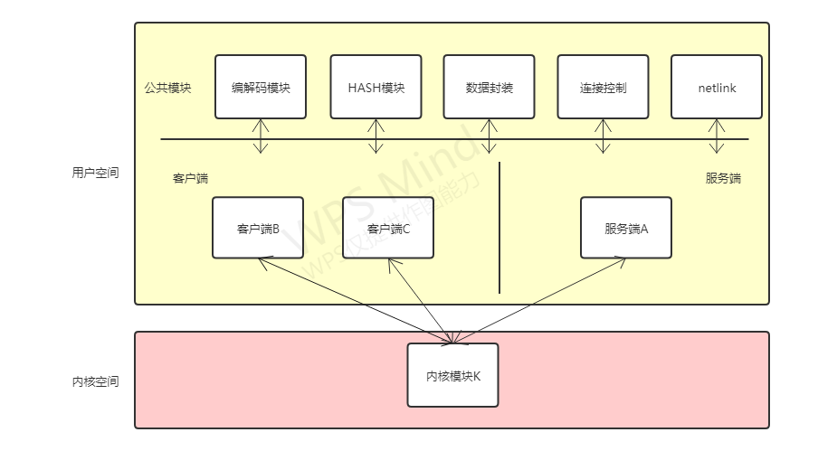

Demo通信软件主要由四个子模块组成，分别是后台服务应用A、客户端应用B、客户端应用C和内核模块K。除了四个子模块之外有五个公共模块：编解码模块、HASH计算模块、封装模块、连接控制模块和netlink模块。客户端服务端调用公共模块与内核模块产生通信。
## 模块流程
### 数据编解码流程
数据编码过程如下图所示，输入合法的原始数据，调用编码函数对数据进行编码，成功则输出编码后数据，返回相应的函数返回值。  

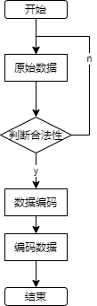

数据解码过程如下图所示，输入合法的编码数据，调用解码函数对数据进行解码，成功则输出原始数据，返回相应的函数返回值。  

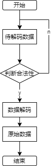

### 数据封装与解封流程
数据封装流程如下图，输入合法性的待发送的数据，输入合法的发送者、接受者和数据类型，调用封装函数完成封装。  

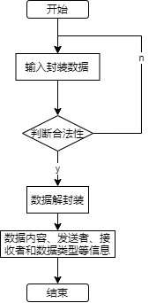

数据封装流程如下图，输入合法性的待解封数据，调用封装函数完成解封装，通过相应变量接收数据、发送者、接受者和数据类型。   

### 数据hash计算流程
hash计算流程如下图，输入待计算的文件或字符串，进行合法性判断，调用相应的文件hash值计算函数或字符串hash值计算函数，得到最终的hash值。

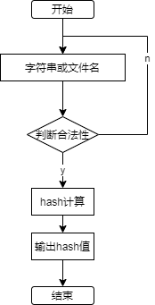

### netlink初始化流程
netlink初始化包括netlink套接字创建和地址绑定，具体流程如下：

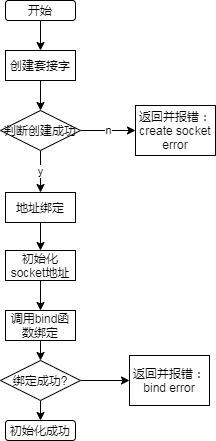

### netlink发送消息流程
netlink消息发送流程首先通过参数获取套接字协议(socket)、待发送的消息(message)、消息长度(len)、发送者端口号(sendid)和接收者端口号(recvid,内核一般是0)。然后判断这些参数的合法性，不合法则返回-1。申请msg消息头nlh的地址空间，若地址空间申请失败，则返回-2。   
   

然后根据获取的参数给消息头和目标地址赋值，代码如下：
```
    nlh->nlmsg_len = NLMSG_SPACE(len);
    nlh->nlmsg_pid = send_pid;
    nlh->nlmsg_flags = 0;
    memcpy(NLMSG_DATA(nlh), message, len);

    iov.iov_base = (void *)nlh;
    iov.iov_len = nlh->nlmsg_len;
    memset(&dest_addr, 0, sizeof(struct sockaddr_nl));
    dest_addr.nl_family = AF_NETLINK;
    dest_addr.nl_pid = recv_pid;
    dest_addr.nl_groups = group;
```

最后通过sendmsg函数将消息发送到内核，内核根据消息内容中封装的信息完成转发，整体流程如下。

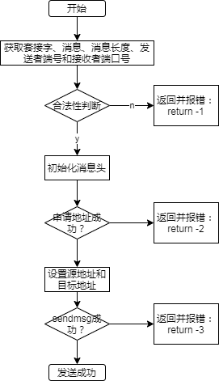

### netlink接收消息流程
netlink消息发送流程首先通过参数获取套接字协议(socket)、接收消息变量(message)、接收消息长度变量(len)。然后判断这些参数的合法性，不合法则返回-1。申请接收msg消息头nlh的地址空间，若地址空间申请失败，则返回-2。  
  

然后对消息头初始化，代码如下：
```
    iov.iov_base = (void *)nlh;
    iov.iov_len = NLMSG_SPACE(MAX_PAYLOAD);
    memset(&source_addr, 0, sizeof(struct sockaddr_nl));
    memset(&msg, 0, sizeof(struct msghdr));
    msg.msg_name = (void *)&source_addr;
    msg.msg_namelen = sizeof(struct sockaddr_nl);
    msg.msg_iov = &iov;
    msg.msg_iovlen = 1;
```
最后通过sendmsg函数从内核接收消息，成功之后将消息赋值给message变量，完成消息接收，整体流程如下。

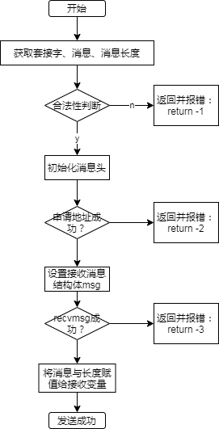

### 客户端与服务端建立连接流程
客户端服务端默认是未连接状态，通过内核中的连接信号变量控制，当信号处于未连接状态时，内核不会转发客户端的消息，只转发连接请求。  
  

客户端发起连接时，会向服务端发送连接口令，服务端收到连接口令后调用连接控制模块进行判断，将连接结果发送给客户端，同时内核在转发这次消息时进行判断，若服务端同意连接则将连接信号置于连接状态，然后转发消息。如果服务端不同意连接，则内核模块直接转发消息。服务端接收到连接结果，连接成功则开始通信，连接失败则重新发起连接，整体过程如下。

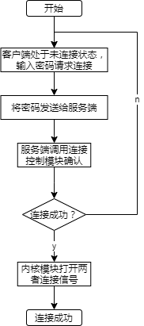

### 客户端与服务端发送消息流程
客户端和服务端的通信是双向的，两者都可主动给对方发送消息。当连接建立成功开始通信时，客户端首先输入数据和消息接收者，经过合法性判断之后，对原始的消息的hash值进行计算保存在变量中。然后消息经过编码封装之后发送给内核，内核根据封装的信息进行发送者接收者的合法性判断，完成转发。 
   

服务端收到消息完成解封解码之后，对收到消息hash值进行计算，封装后转发给客户端。  
  

客户端收到hash值之后，与之前的原始消息的hash值进行校验，如果校验成功则完成通信，如果校验失败则抛出异常。  
通信过程如下。

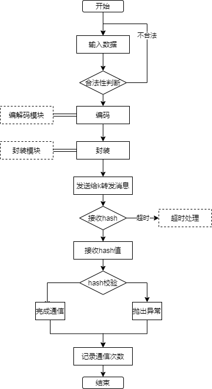{width=80% height=80% position=center angle=0}

### 客户端文件上传流程
客户端可以采用文件模式向服务端上传文件，上传文件主要过程为：首先客户端将本地待上传的文件名发送给服务端；其次服务端收到文件名之后，根据文件名创建相应文件，接收来自客户端的数据并准备写入；然后客户端读取文件，将文件数据编码打包之后发送给服务端，服务端接收之后将数据写入；然后客户端读取完成之后会给服务端发送结束类型消息，服务端接收到结束信号后关闭文件，计算收到的文件的hash值，将hash值发送给客户端；最后客户端收到hash值与本地文件hash值进行对比确定上传成功与否。整体流程如下。

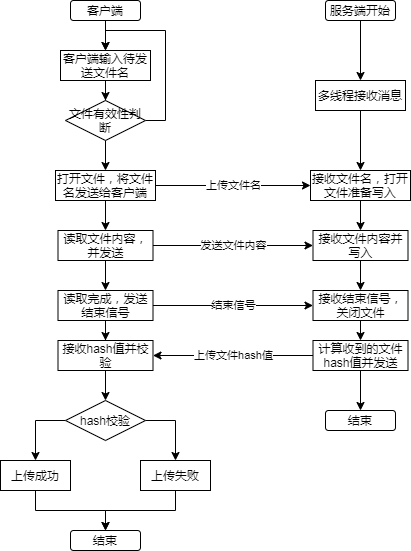

### 客户端下载文件流程
客户端可以采用文件模式从服务端下载文件，下载文件主要过程为：首先客户端将待下载的文件名发送给服务端，服务端接收到文件名打开文件准备读取；然后服务端读取文件将数据编码打包发送给客户端，客户端收到数据写入到文件；当服务端读取发送完成之后，将结束信号和文件hash值发送给客户端，客户端收到结束信号关闭文件；客户端计算下载文件的hash值并与服务端发送的原始文件的hash值进行对比，判断下载成功与否。整体流程如下。


### 内核模块k消息转发流程
内核模块按照一定的规则对收到的应用程序的消息进行转发，首先在默认状态下，客户端服务端是未连接的，客户端和服务端之间的通信除了连接请求外其余消息都会被阻断。客户端直接的所有通信都是非法的，内核模块都不会完成转发。  
  

当连接建立成功时，内核模块收到来自应用程序的消息，首先对消息进行拆包分析，获取消息发送者、接收者和消息类型。如果通信双方是合法的，则判断两者的连接状态，连接成功则完成转发。整体流程如下。

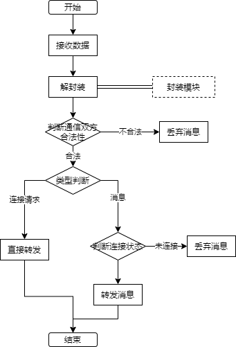


# 外部接口
## 编解码模块
### [msg_encode]
```
int msg_encode(const unsigned char *in, unsigned int inlen, char *out);
```

* 作用：数据编码
* 参数：
	- 参数1:待编码数据指针
	- 参数2:待编码数据长度
  - 参数3:接收编码后数据的变量
* 返回：
	- 非负整型：编码后数据长度
  - 负数：失败错误码


### [msg_decode]

```
int msg_decode(const unsigned char *in, unsigned int inlen, char *out);
```
* 作用：数据解码
* 参数：
	- 参数1:待解码数据指针
	- 参数2:待解码数据长度
  - 参数3:接收解码后数据的变量
* 返回：
	- 非负整型：解码后数据长度
  - 负数：失败错误码

## 连接控制模块
### [passwd_vertify]
```
int passwd_vertify(char *passwd, char name);
```
* 作用：确认连接口令是否有效
* 参数：
	- 参数1:连接口令
	- 参数2:连接客户端名称
* 返回：
	- 1：连接成功
  - -1：连接失败

## 封装模块
### [pack]
```
int pack(const unsigned char *in, unsigned int inlen, char recv, char send, char msgtype, char *out);
```
* 作用：数据封装，加入消息头
* 参数：
	- 参数1:待封装消息
	- 参数2:待封装消息长度
	- 参数3:接收者名称
	- 参数4:发送者名称
	- 参数5:消息类型
  - 参数6:接收封装后数据的变量
* 返回：
	- 非负整型：封装后数据长度
  - 负数：失败错误码

### [unpack]
```
int unpack(const unsigned char *in, unsigned int inlen, char *send, char *msgtype, char *out);
```
* 作用：数据解封，解析消息字符串、长度、发送者、消息类型
* 参数：
	- 参数1:待解封消息
	- 参数2:待解封消息长度
	- 参数3:接收发送者变量
	- 参数4:接收消息类型变量
  - 参数5:接收解封后数据的变量
* 返回：
	- 非负整型：解封后数据长度
  - 负数：失败错误码
## hash模块
### [hash_str]
```
int hash_str(const char *str, int len, char *output);
```
* 作用：计算字符串的hash值
* 参数：
	- 参数1:待计算的字符串
	- 参数2:字符串长度
	- 参数3:接收计算的hash值

* 返回：
	- 1：计算成功
  - 负数：失败错误码

### [hash_file]
```
int hash_file(const char *str, int len, char *output);
```
* 作用：计算文件的hash值
* 参数：
	- 参数1:待计算文件的文件名
	- 参数2:文件名长度
	- 参数3:接收计算的hash值

* 返回：
	- 1：计算成功
  - 负数：失败错误码
## netlink模块
### [netlink_init]
```
int netlink_init(int id);
```
* 作用：netlink初始化，完成套接字创建和地址绑定
* 参数：
	- 参数1:端口号

* 返回：
	- 正整数：成功，返回socket描述符
  - 负数：失败错误码

### [netlink_send_message]
```
int netlink_send_message(int sock_fd, const unsigned char *message, int len, unsigned int send_pid, unsigned int recv_pid, unsigned int group);
```
* 作用：通过netlink向内核发送消息
* 参数：
	- 参数1:socket描述符
	- 参数2:待发送消息
	- 参数3:消息长度
	- 参数4:发送者端口号
	- 参数5:接收者端口号
  - 参数6:接收者所在组

* 返回：
	- 0：成功
  - 负数：失败错误码

:::note
  参数5和参数6在向内核发送消息的时候一般是0，内核默认的端口号和组id为0。
:::

### [netlink_send_message]
```
int netlink_recv_message(int sock_fd, unsigned char *message, int *len);
```
* 作用：通过netlink接收来自内核的消息
* 参数：
	- 参数1:socket描述符
	- 参数2:接收消息变量
	- 参数3:消息长度

* 返回：
	- 0：成功
  - 负数：失败错误码


# Debug流程
## 各模块netlink初始化
当netlink初始化失败时，会有失败错误打印，根据打印可定位原因。主要分为两类：netlink套接字创建失败、地址绑定失败。

debug流程如下图：

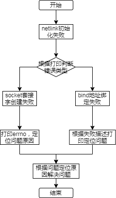

### 套接字创建失败
```
create socket error!
[errno]93
```
当套接字创建失败时，会返回相应的错误码，根据错误码可定位创建套接字失败的原因。如上所示，可以通过errno值93知道，此错误码的原因为 Protocol not supported，根据原因即可定位问题。
### bind地址绑定失败
```
sh-4.4# ./client_b -f
bind: Address already in use
```
当地址绑定失败时，会返回相应的错误码，根据错误码可定位地址绑定失败的原因。如上所示，根据错误打印可知当前地址已经与一个socket描述符绑定，不可重复绑定。
## 消息通信debug
消息通信出问题时，首先需要根据问题场景定位问题所在环节。一般可分为：公共模块问题和客户端与内核模块通信问题。一般debug流程如下图。  

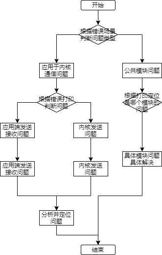

### 公共模块问题
公共模块的问题可通过将每一次调用公共模块时的结果和返回值打印出来判断调用情况定位问题。

+ 编码和解码功能  
编解码失败时，可以根据编解码函数的返回负值定位失败原因。  
+ 数据封装与解封  
编解码失败时，可以根据编解码函数的返回负值定位失败原因。  
+ hash计算  
hash计算错误时，可根据hash计算函数的返回负值定位失败原因。
### 应用层与内核模块通信问题
应用层与内核模块的通信问题主要包括3种情况：应用层发送失败、应用层接收失败、内核模块发送失败。根据出错时的打印可判断是内核发送问题还是应用层发送和接收的问题。

+ 应用层发送失败  
应用层发送失败之后，可打印errno，可根据错误码描述快速定位问题。
+ 应用层接收失败  
应用层接收失败之后，可打印errno，可根据错误码描述快速定位问题。  如下所示，当接收消息失败时，打印对应的errno，查询得知对应的errno描述为Bad file descriptor，查询资料可定位问题原因socet描述符是无效的，根据问题定位可解决问题。

```
[recvmsg error!]
[errno]9
```
+ 内核发送失败  
内核的netlink发送函数会直接返回错误码的值，可根据错误码负值，查询源码中对应的原因定位问题。常见的发送失败错误码和原因如下：  
errno -11 内核发送socket队列已满，前面的消息应用层还未来得及接收，出现-11的错误码就是内核发送的太快，应用端接收的太慢，想办法加快接收速度或者减慢发送速度即可解决。 

``` 
errno -111 #define  ECONNREFUSED  111  /* Connection refused */  
errno -512 ERESTARTSYS
```
一般是内核发送函数为阻塞式的，当队列满了之后，接收端接收停止，内核模块会一直阻塞在发送消息的命令处，直至应用端被结束，此时就会出现-111 和-512 的错误。解决办法可以给发送消息进行超时处理。

# 出错处理
## 容错处理
如下所示，应用的每次输入都会对输入数据的合法性进行判断，如果不合法会返回相应的错误打印，并提示重新输入。
```
start:
    bzero(filename, MAX_FILENAME_SIZE);
    printf("please enter the upload file\n");
    fgets(filename, MAX_FILENAME_SIZE, stdin);
    find = strchr(filename, '\n');
    if (find)
        *find = '\0';

    FILE *fp = fopen(filename, "r");
    if (NULL == fp)
    {
        printf("File:%s Not Found\n", filename);
        printf("Please reEnter the filename!\n");
        goto start;
    }
```

如下所示，在函数接收到数据之后会对数据的有效性进行判断  

```
int netlink_send_message(int sock_fd, const unsigned char *message, int len, unsigned int send_pid, unsigned int recv_pid, unsigned int group)
{
    ...

    if (!message)
    {
        return -1;
    }
    ...

    
}
```

## 函数返回值有效性校验
对每个带返回值的函数的返回值进行有效性检验，根据返回值进行相应的出错处理。
## 应用运行状态监测
内核模块在加载之后，会创建线程定期对应用进程的运行状态进行检测，并将应用的状态通过dmesg进行打印，方便判断应用端的运行状态，针对异常情况进行处理。

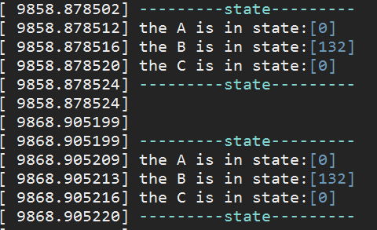{width=70% height=70% position=center angle=0}

# 总结
本详细设计文档主要包括概要、项目背景、各模块功能、源码树结构、主要流程设计、外部接口、debug流程和相应的容错设计，文档的包括的内容不够完善，后续有待补充的内容包括兼容性设计、可测试性设计和环境配置等等。

